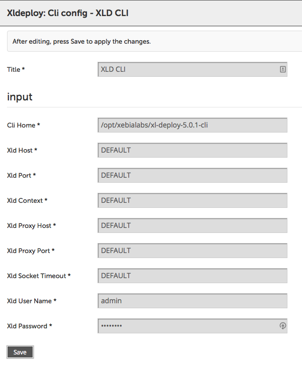
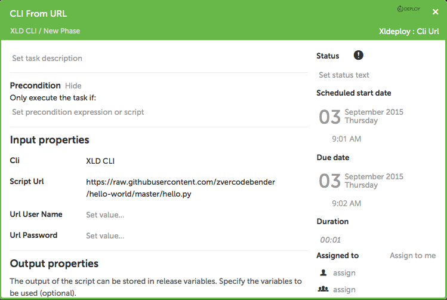

# Build Status #

[](https://travis-ci.org/xebialabs-community/xlr-xldeploy-plugin)


# Preface #

This document describes the functionality provided by the xlr-xldeploy-plugin.

See the **XL Release Reference Manual** for background information on XL Release and release concepts.

# Overview #

The xlr-xldeploy-plugin is a XL Release plugin that allows to start a control task, start a deployment, migrate a deployment package to another server or get the latest version of an application on XL Deploy.

## Installation ##

Place the latest released version under the `plugins` dir. If needed append the following to the `script.policy` under `conf`:

```
permission java.io.FilePermission "plugins/*", "read";
permission java.io.FilePermission "conf/logback.xml", "read";
```

This plugin (2.x.x+) requires XLR 4.8

## Types ##

+ ControlTask (compatible with XL Deploy 4.5.2 and up)
  * `ciId`
  * `controlTaskName`
  * `parameters`
  * `continueIfStepFails` (Will try to continue if a step in a control task fails)
  * `numberOfContinueRetrials` (Number of times to retry a step)
  * `pollingInterval`
  * `numberOfPollingTrials`
  
+ DeployTask (compatible with XL Deploy 4.5.1 and up)
  * `deploymentPackage` (ID of the deployment package to deploy e.g.: `Applications/XL Release/XLR/1.0`)
  * `environment` (ID of the environment to deploy to e.g.: `Environments/Xl Release/XL Release`)
  * `orchestrators` (Comma separated list of orchestrators to be used: `parallel-by-deployment-group, parallel-by-container`)
  * `deployedApplicationProperties` (Dictionary containing all the deployed application properties to be set (except orchestrators). e.g.: `{"maxContainersInParallel": "2"}`)
  * `deployedProperties` (Dictionary containing all the properties to be set. Remark: Each key is an xlrTag in the deployeds - See also [https://github.com/xebialabs-community/xld-xlrelease-plugin](https://github.com/xebialabs-community/xld-xlrelease-plugin), e.g.: `{"Gate1": "{'taskId':'1234567890'}"}`)
  * `continueIfStepFails` (Will try to continue if a step in the deployment task fails)
  * `numberOfContinueRetrials` (Number of times to retry a step)
  * `rollbackOnError` (Whether rollback should be done if the deployment fails)
  * `pollingInterval` (Number of seconds to wait before polling the task status)
  * `numberOfPollingTrials` (Number of times to poll for task status)
  * `failOnPause` (If checked task will fail if the deployment enters a STOPPED state, for example if the xld-pause-plugin is in use. Set to True by default for backwards compatibility)

+ Migrate Package
  * `server` - Server to pull a package from
  * `username` - Override source username
  * `password` - Override source password
  * `destinationServer` - Server to pull package to
  * `destinationUsername` - Override destination username
  * `destinationPassword` - Override destination password
  * `deploymentPackage` - ID of the package to migrate
  * `autoCreatePath` - If set the task will automatically create the path and application if it doesn't exist in the destination

+ Get Latest Version
  * `server` - Server to query
  * `username` - Override username
  * `password` - Override password
  * `applicationId` - ID of the application to query for latest package version
  * `stripApplications` - Whether to strip "Applications/" from the beginning of the returned package ID
  * `packageId` - Return value with the latest package ID

+ Get Last Version Deployed 
  * `server` - Server to query
  * `username` - Override username
  * `password` - Override password
  * `environmentId` - ID of the environment to check the application version on
  * `applicationName` - Name of the applicaiton in the environment to get the current version of
returned package ID
  * `applicationId` - Return value with the current application ID


+ Create CI
  * `server` - Server to query
  * `username` - Override username
  * `password` - Override password
  * `ciID` - Repo path to CI to create, e.g. `Infrastructure/myHost`
  * `ciType` - Type of CI to create, e.g. `overthere.CifsHost`
  * `xmlDescriptor` - XML with the fields to set on the CI, e.g. `<os>WINDOWS</os><connectionType>WINRM_NATIVE</connectionType><address>${address}</address><username>${username}</username><password>${password}</password>`
  * `addToEnvironment` - Switch to decide if to add the CI to an environment
  * `envID` - Environment to add the CI to.

+ CLI Config (Global Configuration)
  * `CLI Home` - Home directory where XL Deploy CLI is installed
  * `XLD Host` - Host the CLI should connect to DEFAULT will work if on the same server as XL Deploy
  * `XLD Port` - Port for XL Deploy server.  DEFAULT will work if using the default XL Deploy port
  * `XLD Context` - XLD CLI context.  If no context is needed then DEFAULT will be fine
  * `XLD Proxy Host` - Proxy host if needed.
  * `XLD Proxy Port` - Proxy Port if needed.
  * `XLD Socket timeout` - Connection timeout to XL Deploy
  * `XLD User Name` - User name to connect to XL Deploy
  * `XLD Password` - Password to connect to XL Deploy
  
  
  
+ CLI
  * `script` - CLI Script to execute
  
  
  
  
+ CLI URL
  * `scriptURL` - URL to CLI Script to execute
  
  
  
  
